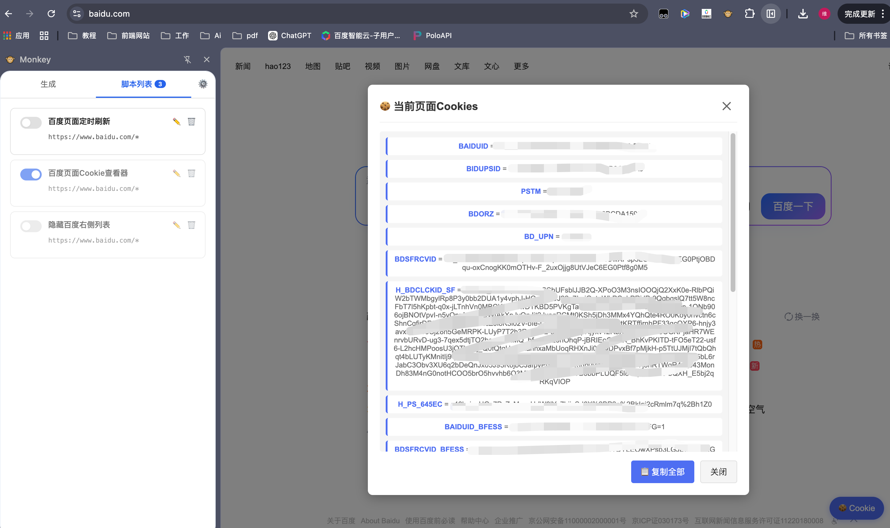
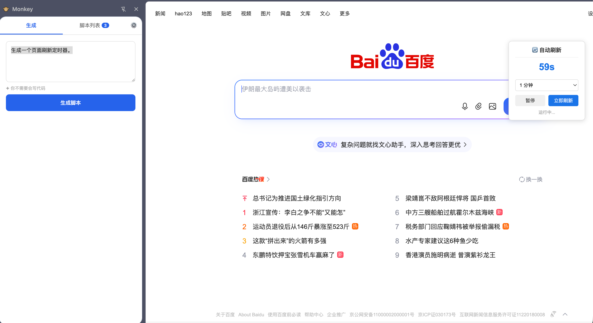

# 🐵 Monkey

> 用自然语言描述需求，AI 帮你生成并注入用户脚本，无需会写代码。


---

## 简介

Monkey 是一个 Chrome 扩展，让你通过自然语言描述来生成用户脚本并自动注入到任意网页中。你不需要会写代码——只需告诉 Monkey 你想在这个页面做什么，它会：

1. 实时抓取当前页面的 DOM 结构
2. 将 DOM 信息注入 prompt，让 AI 写出精准匹配页面元素的脚本
3. 一键保存并立即执行，下次访问同域名自动生效

**使用你自己的 API Key**（BYOK），支持 OpenAI、Claude 以及任何兼容 OpenAI Chat Completions 格式的接口。

---

## 功能特性

- **自然语言生成脚本** — 描述需求，AI 写代码
- **DOM 感知** — 生成前自动提取页面真实结构，选择器精准不靠猜
- **持久化注入** — 脚本保存在本地，匹配域名自动执行
- **流式响应** — 实时看到 AI 生成过程
- **脚本管理** — 列表查看、启用/禁用、编辑、删除
- **BYOK** — 自带 API Key，数据不经过任何第三方服务器
- **兼容多家服务商** — OpenAI、Claude、百度文心、任意 OpenAI 兼容接口
- **隐私优先** — 所有脚本和配置只存在你的浏览器本地存储中

---

## 使用案例

### 案例一：一句话获取页面 Cookie

> 输入描述：「为我生成获取当前页面 cookies 的功能」

Monkey 自动生成脚本，在页面上弹出一个格式化的 Cookie 查看器，展示当前页面的所有 Cookie 键值对，并提供一键复制全部功能。



---

### 案例二：自动倒计时刷新页面

> 输入描述：「生成一个页面倒数刷新的功能」

Monkey 生成一个悬浮计时器，固定显示在页面右上角，倒计时结束后自动刷新页面，支持手动调整刷新间隔。



---

## 安装

### 从源码安装（开发者模式）

```bash
git clone https://github.com/YOUR_USERNAME/monkey.git
```

1. 打开 Chrome，地址栏输入 `chrome://extensions`
2. 右上角开启 **开发者模式**
3. 点击 **加载已解压的扩展程序**
4. 选择项目根目录（包含 `manifest.json` 的目录）
5. 扩展加载成功后，点击工具栏中的 🐵 图标即可打开侧边栏

---

## 使用方法

### 第一步：配置 API Key

首次安装会自动打开设置页。

1. 选择你的 AI 服务商（OpenAI / Claude / 其他）
2. 填入 API Key
3. 点击 **测试连接** 验证可用性
4. 点击 **保存设置**

### 第二步：生成脚本

1. 打开任意网页
2. 点击工具栏 🐵 图标打开侧边栏
3. 在输入框描述你的需求，例如：
   - `隐藏页面右侧的广告栏`
   - `把所有外链在新标签页打开`
   - `搜索框自动获取焦点`
4. 点击 **生成脚本**
5. 查看 AI 生成的描述和代码，确认生效范围（URL 匹配规则）
6. 点击 **好，保存并执行** — 脚本立即在当前页面运行，并保存供以后自动执行

### 第三步：管理脚本

切换到 **脚本列表** 标签可以：
- 开关启用/禁用某个脚本
- 编辑脚本代码
- 删除不需要的脚本

---

## 技术架构

```
manifest.json          MV3 配置，无 popup，直接打开 sidepanel
│
├── background/
│   └── service-worker.js    消息路由 + 脚本存储单写 + tabs.onUpdated 自动注入
│
├── sidepanel/
│   ├── index.html           主界面（12 种交互状态）
│   ├── sidepanel.css        UI 样式
│   └── sidepanel.js         AI 流式调用 + DOM 快照 + 确认执行
│
├── options/
│   ├── index.html           设置页
│   ├── options.css
│   └── options.js           BYOK 配置 + 连通性测试
│
├── content/
│   └── content.js           轻量 shim，保持消息通道存活
│
└── design/
    └── tokens.css           全局 CSS 设计令牌
```

### 关键设计决策

| 问题 | 方案 | 原因 |
|------|------|------|
| 脚本注入方式 | `chrome.scripting.executeScript(world:'MAIN')` | `<script>` 标签受页面 CSP 限制，此 API 明确豁免 |
| 存储 | `chrome.storage.local` + `unlimitedStorage` | Content Script 无法访问 Extension IndexedDB |
| 单一写入者 | Background SW 统一处理所有存储写操作 | 防止并发写入竞态条件 |
| AI 调用位置 | Sidepanel（持久页面） | 避开 MV3 Service Worker 30 秒空闲超时 |
| Tab 定位 | `lastFocusedWindow:true` | Sidepanel 不是 tab，`currentWindow` 不可靠 |
| DOM 快照 | 生成前注入提取脚本，获取 ID/表单/按钮结构 | 给 AI 真实选择器，避免幻觉出错误 class 名 |

### URL 匹配规则

采用 Tampermonkey `@match` glob 语法：

```
https://www.example.com/*     匹配该域名所有路径
https://*.example.com/*       匹配所有子域名
*://*/*                       匹配所有 HTTP/HTTPS 页面
<all_urls>                    匹配所有页面
```

### StoredScript 数据结构

```ts
interface StoredScript {
  id: string;          // UUID v4
  name: string;        // 来自 @name，默认"未命名脚本"
  code: string;        // 完整脚本含 ==UserScript== 头
  pattern: string;     // @match 值
  runAt: 'document-end' | 'document-start' | 'document-idle';
  enabled: boolean;
  createdAt: number;   // Date.now()
}
```

---

## 支持的 AI 服务商

| 服务商 | Endpoint | 推荐模型 |
|--------|----------|----------|
| OpenAI | `https://api.openai.com/v1/chat/completions` | `gpt-4o` |
| Anthropic Claude | `https://api.anthropic.com/v1/messages` | `claude-sonnet-4-6` |
| 其他兼容接口 | 自定义填写 | 按服务商文档填写 |

任何兼容 OpenAI Chat Completions 格式的接口均可使用（如本地部署的 Ollama、各类国内大模型代理等）。

---

## 隐私说明

- **API Key 只存在你的浏览器** `chrome.storage.local` 中，从不上传任何服务器
- **页面内容只发给你配置的 AI 服务**，用于生成脚本，Monkey 项目本身不收集任何数据
- **生成的脚本只存在你的浏览器本地**，不同步到任何云端

---

## 开发

```bash
# 克隆项目
git clone https://github.com/YOUR_USERNAME/monkey.git
cd monkey

# 无需构建步骤，直接加载到 Chrome
# 修改代码后在 chrome://extensions 点击扩展的刷新按钮即可生效
```

### 调试

- **Sidepanel**：右键侧边栏空白处 → 检查 → Console
- **Background SW**：`chrome://extensions` → 扩展卡片 → "Service Worker" 链接 → Console
- **Content Script**：目标页面的 F12 → Console（过滤 `[monkey`）

---

## 待实现（TODO）

- [ ] 脚本执行报错后，自动将错误信息反馈给 AI 进行修复（TODO-1）
- [ ] SPA 路由变化监听，支持单页应用（`chrome.webNavigation.onHistoryStateUpdated`）（TODO-2）
- [ ] 脚本导出为 `.user.js` 文件，兼容 Tampermonkey（TODO-3）

---

## License

MIT
